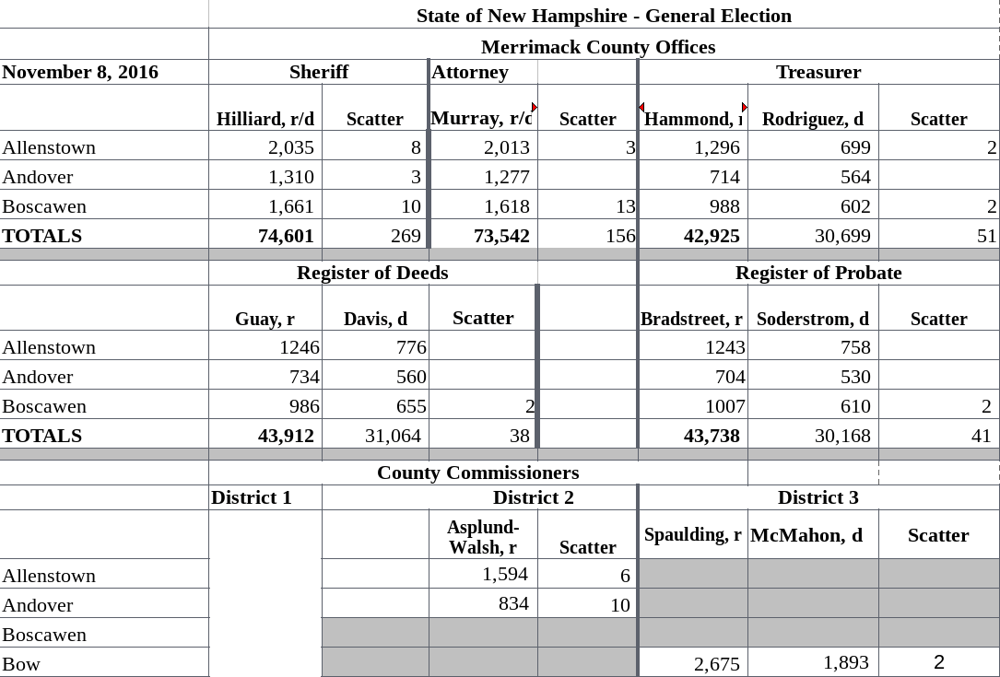

The problem
===========

```{r, echo = FALSE}

```

Pretend it's tabular?
=====================

```{r, message=FALSE}
library(dplyr)
library(stringr)
library(readxl)
library(medslcleaner)

merrimack_path = spreadsheet_example('merrimack')
read_excel(merrimack_path, col_names = FALSE) %>%
  head()
```

Alternative solution 
====================

1. Identify which cells are **data** and which are **headers**
2. Define the **relationships** between data cells and header cells

```{r, echo = FALSE}

```

Tools
=====

R packages:

* `tidyverse`
* `tidyxl`
* `unpivotr`
* `medslcleaner`

Read the data
=============

```{r, message = FALSE}
library(medslcleaner)
library(tidyverse)
library(tidyxl)
library(unpivotr)

# For this example only: get path to the spreadsheet
merrimack_path = spreadsheet_example('merrimack')

cells = xlsx_cells(merrimack_path, sheet = 1)  # from tidyxl
```

Representation in R
===================

```{r}
cells %>%
  select(address, row, col, data_type, character, numeric) %>%
  head()
```

Associate headers with cells
============================
```{r}
cells = cells %>%
  filter(row > 2) %>%
  behead('W', 'precinct')

cells %>%
  filter(row > 4) %>%
  arrange(row, col) %>%
  select(address, row, col, character, numeric, precinct)
```

Associate headers with cells
============================
```{r}
cells = cells %>%
  behead('NNW', 'office') %>%
  behead('N', 'candidate')

cells %>%
  arrange(row, col) %>%
  select(address, row, col, character, numeric, precinct, office, candidate)
```

Finalize
========
```{r}
cells = cells %>%
  select(address, row, col, precinct, office, candidate, votes = numeric)

head(cells)
```

Schema
======

Field schema define our expectations about data:

```
- name: votes
  title: Vote Count
  description: Number of votes received.
  source: Precinct returns for `jurisdiction`.
  type: integer
  constraints:
    required: true
```

Representation in R
===================

```{r}
data(fields, package = 'medslcleaner')
fields[['votes']]
```

Validation
==========

```{r}
data(wyoming, package = 'medslcleaner')
wyoming %>%
  mutate(precinct = substr(precinct, 1, 10)) %>%
  select(state_postal, jurisdiction, precinct, office, candidate, writein, votes) %>%
  head()
```

Validation
==========

```{r, collapse = TRUE}
validate(wyoming)
```

Validation
==========

```{r, collapse = FALSE}
returns = data.frame(votes = c(2, NA))
returns

# validate_field(returns, 'votes')
#> Error: votes has missing values.

select_missing(returns, 'votes')
```

Validation
==========

```{r, collapse = FALSE}
# validate(returns)
#> Error: .data does not have name year
```

Resources
====================

* [unpivotr documentation](https://nacnudus.github.io/unpivotr/): <https://nacnudus.github.io/unpivotr>
* [medslcleaner github](https://github.com/MEDSL/medslcleaner/): <https://github.com/MEDSL/medslcleaner>
* [tidyxl documentation](https://nacnudus.github.io/tidyxl): <https://nacnudus.github.io/tidyxl/>
* [*Spreadsheet Munging Strategies*](https://nacnudus.github.io/spreadsheet-munging-strategies): <https://nacnudus.github.io/spreadsheet-munging-strategies>

