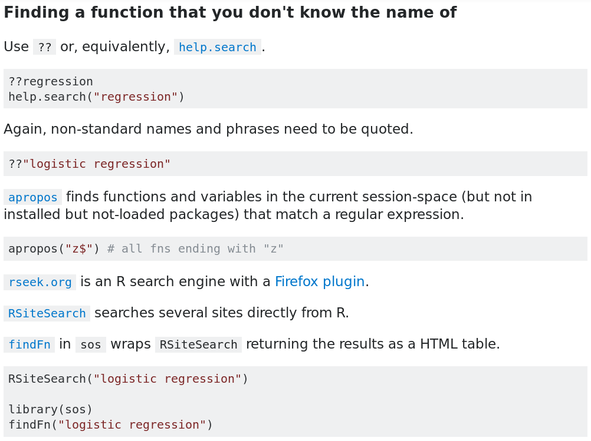
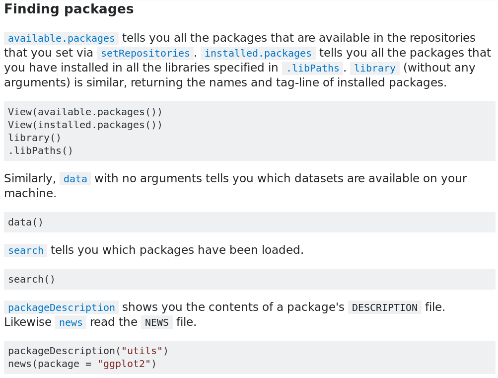
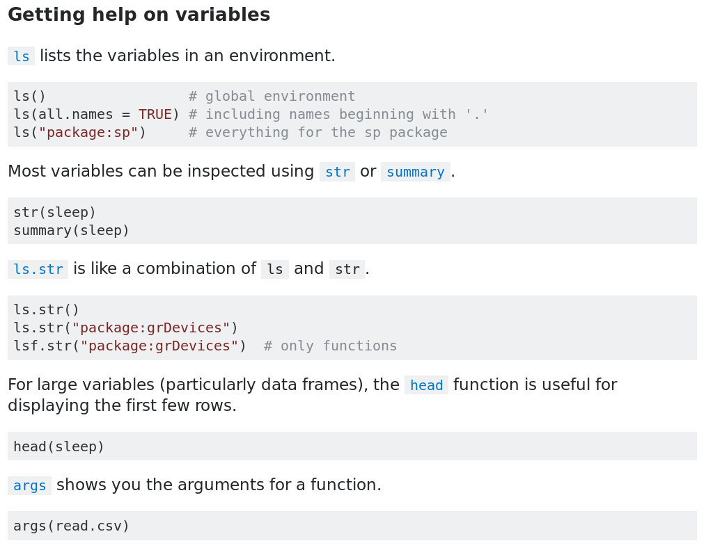

```{r setup, include=FALSE}
library(knitr)  
library(kableExtra)
library(pander)
library(tidyverse)
library(tidyxl)
library(dplyr)
library(readxl)
devtools::load_all('.')
# # To render PDF:
# rmarkdown::render('excel.Rmd')
knitr::opts_chunk$set(cache = TRUE)
options(knitr.kable.NA = '')
```

Installing R
============

* Install R from https://cloud.r-project.org

* Also install RStudio, an interface for working in R: https://www.rstudio.com/products/rstudio/download

Writing R code (R4DS)
===========

```{r}
1 / 200 * 30
```

&nbsp;\

```{r}
(59 + 73 + 2) / 3
```

&nbsp;\

```{r}
sin(pi / 2)
```

Assignment (R4DS)
=================

Create new objects with `<-`:

```{r}
x <- 3 * 4
x
```

&nbsp;\


All R statements where you create objects have the same form:

```{r, eval = FALSE}
object_name <- value
```

&nbsp;\

Errata:

* Shortcut in RStudio for typing `<-` is ALT-minus
* `=` is an alternative to `<-`. It's either convenient and the universal
assignment operator or *dangerous* and *lazy.*
* `->` also exists, because R.

Functions (R4DS)
=========

R has a large [*ed:* bloated] collection of built-in functions.

Called like this:

```
function_name(arg1 = val1, arg2 = val2, ...)
```

&nbsp;\

For example:

```{r}
seq(1, 10)
```

&nbsp;\

Assign the *return value*:

```{r}
x <- seq(1, 10)
```

Getting help
============

Function help:

```{r, eval = FALSE}
?seq
help(seq)
```

Other sources of help:

* [rdocumentation.org](https://www.rdocumentation.org)

* [stackoverflow.com](https://stackoverflow.com/questions/tagged/r)

* [#r on Slack](https://medsl.slack.com/messages/CBP4JB6EA)

StackOverflow
=============


StackOverflow
=============



StackOverflow
=============



StackOverflow
=============



The hadleyverse (tidyverse)
==========================

```{r echo=FALSE, fig.align='center'}
knitr::include_graphics('hadley.png', dpi = round(96 * 1.7))
```

```{r message=FALSE, eval = FALSE, warning=FALSE, results='hide'}
# https://www.tidyverse.org/
install.packages("tidyverse")
library(tidyverse)
```

A grammar for data
==================

```{r}
data('mpg', package = 'ggplot2')
mpg %>%
  select(manufacturer, model, displ) %>%
  head(3)
```

A grammar for data
==================

```{r}
mpg %>%
  select(manufacturer, model, displ) %>%
  filter(displ > 2) %>%
  head(3)
```

A grammar for data
==================

```{r}
mpg %>%
  select(manufacturer, model, displ) %>%
  filter(displ > 2) %>%
  mutate(displ_squared = displ ^ 2) %>%
  head(3)
```


Resources
=========

RStudio Cheatsheets:

* ["Data Import"](https://github.com/rstudio/cheatsheets/raw/master/data-import.pdf)

* ["Data Transformation"](https://github.com/rstudio/cheatsheets/raw/master/data-transformation.pdf)

* ["Work with Strings"](https://github.com/rstudio/cheatsheets/raw/master/strings.pdf)

* ["RStudio"](https://github.com/rstudio/cheatsheets/raw/master/rstudio-ide.pdf)

Books:

* [*R for Data Science*](http://r4ds.had.co.nz/index.html), especially the section "Wrangle"

* [*An Introduction to Statistical and Data Sciences via R*](http://moderndive.com)

Courses:

* DataCamp's [*Introduction to R*](https://www.datacamp.com/courses/free-introduction-to-r)

* [*R Basics*](https://learn.edx.org/harvard-r-basics) from Harvard's edX Data Science Series 


Workflow
========


Our toolkit
===========

Install once:

```{r, eval = FALSE}
install.packages("tidyverse")
install.packages("tidyxl")
install.packages("devtools")
devtools::install_github('MEDSL/medslcleaner')
```

&nbsp;\

Load every time:

```{r, message = FALSE}
library(tidyverse)
library(tidyxl)
library(medslcleaner)
```

Source data
===========


Multiple headers:

* Row 2: `jurisdiction` 
* Row 3: `office`
* Row 4: `candidate`
* Column A: `precinct`

Source data
===========


Multiple-column or "merged" cells:

* `Sheriff`
* `Attorney`
* `Treasurer`

Typical approach
================

```{r, message=FALSE, results = 'hide'}
# Get the path to the packaged example
merrimack_path <- spreadsheet_example('merrimack')

# Use `read_excel` from the `readxl` package
sheet <- read_excel(merrimack_path)
```


Result
======

```{r}
sheet %>%
  # Select first three columns
  select(1:3)
```

Alternative approach 
====================

Using `medslcleaner` and `tidyxl`,

&nbsp;\

* Identify which cells are *data* and which are *headers*

* Define the relationships between data cells and header cells

Reading from the disk
=====

Instead of `read_excel`,

```{r}
cells <- read_xlreturns(merrimack_path)
```

&nbsp;\

```{r}
# Take a look at a few rows and columns
peek <- cells %>%
  select(-sheet) %>%
  filter(data_type != "blank") %>%
  filter(row > 3)
```

Result
======

```{r}
head(peek)
```

&nbsp;\

* Each row gives the contents of a single spreadsheet cell;

* Columns `row` and `col` give the cell's position;

* Excel identifies columns with letters, but we're using numbers.

Associating headers and data 
============================

Consider again the precinct names in column `1` of the Merrimack spreadsheet.

&nbsp;\

```{r}
cells %>%
  select(-sheet) %>%
  filter(col == 1 & row > 4)
```

Associating headers and data 
============================

To associate each `precinct` header with all the cells to their right:

&nbsp;

```{r}
cells <- cells %>%
  as_header('precinct', cols = 1, right = TRUE)
```

&nbsp;\

* We just created a new variable `precinct`

* It takes as values the contents of cells where `col` is `1` (otherwise `NA`) ...

* For all the cells to the `right` of the header cells in the spreadsheet

Associating headers and data 
============================

The result:

&nbsp;

```{r}
cells %>%
  filter(row > 4) %>%
  select(-sheet) %>%
  head()
```


`as_header`
==========

```
function (.data, idcol, rows = TRUE, cols = TRUE,
  right = FALSE,  down = FALSE, .drop = TRUE) 
```

&nbsp;\

Identifying headers:

* Arguments `row` and `col` select header cells by spreadsheet row and column indexes

* If we specify `rows = 2`, values of the second row in the spreadsheet would be considered header values

* With both `rows = 2` and `cols = 1`, we could define the cell in the second row and first column as a header cell

* In more difficult cases, we can use logical functions for selection

`as_header`
==========

```
function (.data, idcol, rows = TRUE, cols = TRUE,
  right = FALSE,  down = FALSE, .drop = TRUE) 
```

&nbsp;\

Identifying data:

* Identify data cells by giving directions from header cells

* We can move rightward, downward, or both

`as_header`
==========

```
function (.data, idcol, rows = TRUE, cols = TRUE,
  right = FALSE,  down = FALSE, .drop = TRUE) 
```

&nbsp;\

Argument `.drop`:

* Defining cells as headers drops them from the data after moving their values into a new column 

* One way to think of the `as_header` function is as transformation of headers from spreadsheet cells into characteristics of spreadsheet cells.

Associating headers and data 
============================

Let's do the remaining identifiers:

```{r}
cells <- cells %>%
  as_header('jurisdiction', rows = 2, cols = 2,
    down = TRUE, right = TRUE) %>%
  as_header('office', rows = 3, right = TRUE,
    down = TRUE) %>%
  as_header('candidate', rows = 4, down = TRUE)
```

Associating headers and data 
============================

Finally, to keep only the columns we created and rename the `value` column
`votes`:

```{r}
cells <- cells %>%
  filter(row > 4) %>%
  finalize()

glimpse(cells)
```

Full Solution
=============

```{r}
cells <- read_xlreturns(merrimack_path)

cells <- cells %>%
  as_header('jurisdiction', rows = 2, cols = 2,
    down = TRUE, right = TRUE) %>%
  as_header('precinct', cols = 1, right = TRUE) %>%
  as_header('office', rows = 3, right = TRUE,
    down = TRUE) %>%
  as_header('candidate', rows = 4, down = TRUE)

# Drop remaining header rows and `finalize`
cells <- cells %>%
  filter(row > 4 & col> 1) %>%
  finalize()
```

Validation
==========

Schema define our expectations about data:

&nbsp;\

```
- name: votes
  title: Vote Count
  description: Number of votes received.
  source: Precinct returns for `jurisdiction`.
  type: integer
  constraints:
    required: true
```

Representation in R
===================

```{r}
data(fields, package = 'medslcleaner')
str(fields[['votes']])
```

Validation
==========

```{r}
data(wyoming, package = 'medslcleaner')
wyoming %>%
  mutate(precinct = substr(precinct, 1, 10)) %>%
  select(state_postal, jurisdiction, precinct, 
    office, candidate, writein, votes) %>%
  head()
```

Validation
==========

```{r, collapse = TRUE}
validate(wyoming)
```

Validation
==========

```{r, collapse = FALSE}
returns <- data.frame(votes = c(2, NA))
returns
```

```{r, eval = FALSE}
validate_field(returns, 'votes')
```

```{r}
#> Error: votes has missing values.
```

Validation
==========

```{r}
select_missing(returns, 'votes')
```

```{r, eval = FALSE}
validate(returns)
```

```{r, collapse = FALSE}
#> Error: .data does not have name year
```

Spreadsheet resources
=================

* [medslcleaner documentation](https://github.com/MEDSL/medslcleaner/)

* [tidyxl documentation](https://nacnudus.github.io/tidyxl)

* [*Spreadsheet Munging Strategies*](https://nacnudus.github.io/spreadsheet-munging-strategies)

