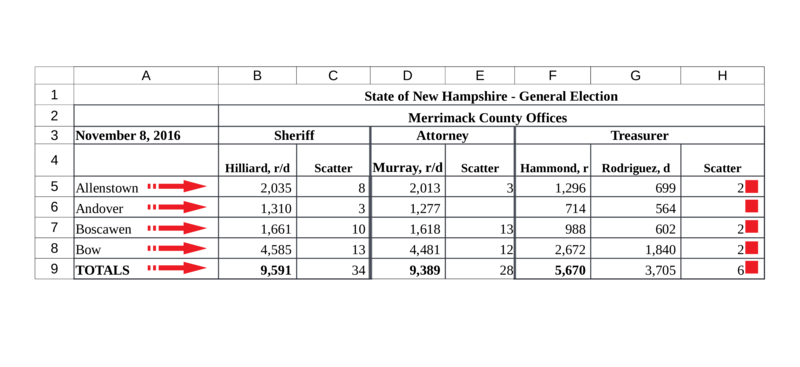

This vignette demonstrates the extraction of election results from Excel and CSV
files using the `medslcleaner` package. We introduce the available tools and
show solutions for common spreadsheet layouts.

```{r, knitr-options, echo = FALSE, result = 'hide', message = FALSE}
# rmarkdown::render('excel.Rmd')
knitr::opts_chunk$set(
  fig.width = 5,
  # dev = 'png',
  echo = TRUE
  # collapse = TRUE,
  # cache = FALSE,
  # comment = "#>"
  )
devtools::load_all(export_all=FALSE)
```

# Tutorial

The following is an excerpt from the Excel-formatted source data for Merrimack,
New Hampshire. 


## Problem

Reading this sheet into R as if it were ordinary tabular data doesn't work
very well. 

```{r, message=FALSE}
library(dplyr)
library(stringr)
library(readxl)

merrimack_path = excel_example_path('merrimack')
read_excel(merrimack_path, col_names = FALSE) %>%
  head()
```

Notice:

* *Multiple header rows:* The jurisdiction is in row `2`. Row `3`
indicates offices. Row `4` gives candidates. We refer to these rows as header rows, and their non-blank cells as header cells.

* *Multiple-column or "merged" cells:* the header cells with values `Sheriff`,
`Attorney`, and `Treasurer` are associated with both of the two columns beneath
them. But under this approach, the header cell values appear only above the
first column.


## Solution

Here's where we're going:

```{r}
# Instead of `read_excel`, `read_xlreturns`
d = read_xlreturns(merrimack_path)

# The main function for reshaping Excel data is `as_idcol`
d = d %>%
  as_idcol('jurisdiction', i = 2, j = 2, down = TRUE, right = TRUE) %>%
  as_idcol('precinct', j = 1, right = TRUE) %>%
  as_idcol('office', i = 3, right = TRUE, down = TRUE) %>%
  as_idcol('candidate', i = 4, down = TRUE) 
  
# Drop remaining header rows and `finalize`
d = d %>%
  filter(row > 4 & col> 1) %>%
  finalize()

head(d)
```

Some cleaning up remains, but the heavy lifting is done in fewer than 10 lines.

## Steps

### Reading from the disk

We read the data with function `read_xlreturns`. 

```{r}
d = read_xlreturns(merrimack_path, sheet = 1)

# Take a look
d %>%
  select(address, row, col, value) %>%
  head()
```

### Spreadsheet data in R

Consider how the spreadsheet is now represented in R. Each element in the
`value` column gives the contents of a single spreadsheet cell. Columns `row`
and `col` indicate the row and column of that cell. (Excel identifies columns
with letters, but we use numbers.)

This format will turn out to be convenient, but right now the relationship
between headers and vote cells is unclear.

### Associating headers with vote cells

Our task is to specify all of the relationships between header cells and vote
cells. We do this with the `as_idcol` function. It adds a new column to the data
that takes its values from header cells -- for all the vote cells we specify as
associated with that header.

We can select header cells by their row and column indexes. (Or in more
difficult spreadsheets with logical functions, as discussed later.) `as_idcol`
takes arguments `i` and `j` for row(s) and column(s). For example, if we
specified `i = 2`, the values of the second row in the spreadsheet would be
considered header values. With both `i = 2` and `j = 1`, we could define the
cell in the second row and first column as a header cell. So `i` and `j` define
part of the relationship between headers and votes -- by identifying which cells
are headers.

We identify the vote cells associated with a header by giving directions from
the header cell. We can move rightward in the spreadsheet from a header cell,
associating it with all the vote cells in the spreadsheet row to its right. We
can move downward, linking the header with the vote cells below its spreadsheet
column. Or, we can do both at once, associating a header with all the vote cells
under it and to the right. The arguments `right` and `down` control this behavior.

What makes this operation powerful for extracting data from spreadsheets is our
ability to specify more than one row in `i` or column in `j`. 

The source cell or cells then drop from the data (by default).

Consider again the precinct names in column `1` of the Merrimack spreadsheet. To
associate them with all the vote counts to their right, we do this:

```{r}
# `j = 1` refers to the first column  
d = as_idcol(d, 'precinct', j = 1, right = TRUE)
```

We just created a new variable `precinct` that takes as values the contents of
cells where `j` is `1` (otherwise `NA`), for all the vote cells to their `right`
in the spreadsheet. 

Defining cells as headers causes them to drop them from the spreadsheet data (by
default) after moving their values into the new identifier column in the
spreadsheet data. One way to think of the `as_idcol` function is as
transformation of headers from spreadsheet cells into characteristics of
spreadsheet cells.



The result is this:

```{r}
d %>%
  filter(row > 4) %>%
  select(address, row, col, precinct) %>%
  head()
```

Let's do the remaining identifiers:

```{r}
d = d %>%
  as_idcol('jurisdiction', i = 2, j = 2, down = TRUE, right = TRUE) %>%
  as_idcol('office', i = 3, right = TRUE, down = TRUE) %>%
  as_idcol('candidate', i = 4, down = TRUE)
```

Finally, to keep only the columns we created and rename the `value` column
`votes`:

```{r}
d = d %>%
  filter(row > 4) %>%
  finalize()

head(d)
```

To finish processing this data per the MEDSL schema for precinct returns,
there's a bit more work to do. We'd clean up the values of `jurisdiction` as
`Merrimack County`, and split the party abbreviations in the `candidate` column
(e.g., `r` and `d`) into their own `party` column. But we've reached our goal of
parsing the Excel file into a tidy dataframe.

This ends the tutorial. The sections that follow demonstrate solutions for more
difficult spreadsheets. In particular, they introduce more flexible ways of
specifying arguments `i` and `j`: using functions to select the desired rows and
columns.


## Multiple tables per spreadsheet (WIP)

In the complete New Hampshire precinct returns, each spreadsheet contains many tables like the one used in the tutorial, stacked vertically ... 

[figure]

The `split_cells` function searches cell values for a pattern, and splits the spreadsheet along the rows that contain matches. It returns a list of single tables that we can iterate over. An effective pattern for splitting the Merrimack sheet is `TOTALS`. It matches rows `9`,
`17`, and `26` in column `1`. Each of these rows ends a table.

```{r}
# cells = split_cells(.data = sheet, pattern = 'TOTALS', starts = FALSE)
# str(cells)
```

The output indicates that the result is a split into three tables: the first
split extends from row `1` through the first pattern match in row `9`; the
second split begins in row `10` and ends with the next match in row `17`, and so
on. Our pattern identified the rows that *end* tables, so we specified `starts =
FALSE`. If instead we saw a pattern indicating the starts of tables, we would
use the default `starts = TRUE`. (One such pattern is
`'sheriff|register|commissioners'`, which gives ranges `3:10`, `11:18`, and
`19:26`.)
