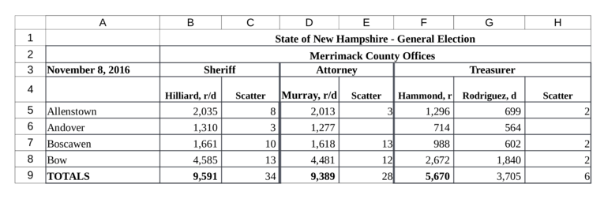

This vignette demonstrates the extraction of election results from Excel files
using the `medslcleaner` package. We'll introduce a toolset and workflow for
examples of common spreadsheet layouts.

```{r, knitr-options, echo = FALSE, result = 'hide', message = FALSE}
# rmarkdown::render('excel.Rmd')
knitr::opts_chunk$set(
  fig.width = 5,
  # dev = 'png',
  echo = TRUE
  # collapse = TRUE,
  # cache = FALSE,
  # comment = "#>"
  )
devtools::load_all(export_all=FALSE)
```

# Tutorial

The following is an excerpt from the Excel-formatted source data for Merrimack,
New Hampshire. 



Reading this sheet into R as if it were ordinary tabular data, with the
excellent [`readxl`](https://github.com/tidyverse/readxl) package, doesn't work
very well. 

```{r, message=FALSE}
library(dplyr)
library(stringr)
library(readxl)

merrimack_path = excel_example_path('merrimack')

read_excel(merrimack_path, col_names = FALSE) %>%
  head()
```

Notice:

* **Multiple header rows:** We see the jurisdiction in row `2`. Row `3`
indicates offices. Row `4` gives candidates.

* **Multiple-column or "merged" cells:** headers `Sheriff`, `Attorney`, and
`Treasurer` each apply to two columns. But in R, these values occupy only the
first of the merged columns.

We can use some `medslcleaner` functions to extract the vote counts for each
candidate, by precinct, and correctly associate candidates with offices,
districts, and parties. Here's where we're going:

```{r}
# Instead of `read_excel`, `read_xlreturns`
d = read_xlreturns(merrimack_path)

# The main function for reshaping Excel data is `as_idcol`
d = d %>%
  as_idcol('jurisdiction', i = 2, j = 2, down = TRUE, right = TRUE) %>%
  as_idcol('precinct', j = 1, right = TRUE) %>%
  as_idcol('office', i = 3, right = TRUE, down = TRUE) %>%
  as_idcol('candidate', i = 4, down = TRUE) 
  
# Drop remaining header rows and `finalize`
d = d %>%
  filter(row > 4 & col> 1) %>%
  finalize()

head(d)
```

Some parsing remains, but that's the heavy lifting in fewer than 10 lines. Now
step by step. We read the data with function `read_xlreturns`. You can specify a
sheet other than the first with the `sheet` argument.

```{r}
d = read_xlreturns(merrimack_path, sheet = 1)

# Take a look
d %>%
  select(address, row, col, value) %>%
  head()
```

Consider how the spreadsheet has been represented in R, as shown above. The
columns you need to know about are `value`, `i`, and `j`. Each element in the
`value` column gives the contents of a single spreadsheet cell. Columns `i` and
`j` indicate the row and column indexes of that cell.

Excel indexes columns with letters, but we're using numbers *j ∈ 1, ..., K* for
*K* columns and index rows *i ∈ 1, ..., N* for *N* rows. Each row in the cell
data (our representation of the spreadsheet in R) thus gives an `(i, j, value)`
triple like `(3, 2, 'Sheriff')` or `(3, 3, 'Attorney')`.

With that in mind, we use the `as_idcol` function to create new columns (say,
`office`) from values that don't represent vote counts. We specify which cells
contain these values using indexes. (In more difficult scenarios we can use
functions, but more on that later.) The `as_idcol` function takes arguments `i`
and `j` to identify which row(s) and column(s) to select. We can carry these
cells' contents right along rows using `right = TRUE` or down columns with `down
= TRUE`, or both. The source cell or cells then drop from the data (by default).

Consider the precinct names in column `1`. To identify them as describing all
the vote counts to their right, we can do this:

```{r}
# `j = 1` refers to the first column  
d = as_idcol(d, 'precinct', j = 1, right = TRUE)
```

What did this call do? All the values in column `j=1` describe the cells to
their `right`. We created a new variable `precinct` that takes as values the
contents of cells where `j` is `1` (otherwise `NA`). We then carried these
values `right` across rows.

```{r, echo = FALSE}
# FIXME: hack for pandoc error
path = 'merrimack-carry-precincts-right.png'
knitr::include_graphics(file.path(normalizePath(dirname(path)), path))
```

The `right` argument carries cell contents matched by `i` and `j` along their
rows until either the next matching cell (specified in `i` or `j`) or the end of
the row or column, whichever comes first. The result is this:

```{r}
d %>%
  filter(row > 4) %>%
  select(address, row, col, precinct) %>%
  head()
```

If you're familiar with "last observation carry-forward," you might recognize
this operation as LOCF on non-missing values.

Let's do the remaining identifiers:

```{r}
d = d %>%
  as_idcol('jurisdiction', i = 2, j = 2, down = TRUE, right = TRUE) %>%
  as_idcol('office', i = 3, right = TRUE, down = TRUE) %>%
  as_idcol('candidate', i = 4, down = TRUE)
```

Finally, to keep only the columns we created and rename the `value` column
`votes`:

```{r}
d = d %>%
  filter(row > 4) %>%
  finalize()

head(d)
```

To finish processing this data per the MEDSL schema for precinct returns,
there's a bit more work to do. We'd clean up the values of `jurisdiction` as
`Merrimack County`, and split the party abbreviations in the `candidate` column
(e.g., `r` and `d`) into their own `party` column. But we've reached our goal of
parsing the Excel file into a tidy dataframe.

This ends the tutorial. The sections that follow demonstrate solutions for more
difficult spreadsheets. In particular, they introduce more flexible ways of
specifying arguments `i` and `j`: using functions to select the desired rows and
columns.


## Multiple tables per spreadsheet (WIP)

In the complete New Hampshire precinct returns, each spreadsheet contains many tables like the one used in the tutorial, stacked vertically ... 

[figure]

The `split_cells` function searches cell values for a pattern, and splits the spreadsheet along the rows that contain matches. It returns a list of single tables that we can iterate over. An effective pattern for splitting the Merrimack sheet is `TOTALS`. It matches rows `9`,
`17`, and `26` in column `1`. Each of these rows ends a table.

```{r}
# cells = split_cells(.data = sheet, pattern = 'TOTALS', starts = FALSE)
# str(cells)
```

The output indicates that the result is a split into three tables: the first
split extends from row `1` through the first pattern match in row `9`; the
second split begins in row `10` and ends with the next match in row `17`, and so
on. Our pattern identified the rows that *end* tables, so we specified `starts =
FALSE`. If instead we saw a pattern indicating the starts of tables, we would
use the default `starts = TRUE`. (One such pattern is
`'sheriff|register|commissioners'`, which gives ranges `3:10`, `11:18`, and
`19:26`.)
